# AI Agents Studio - Architecture Diagrams

This document contains visual representations of the system architecture using Mermaid diagrams.

---

## System Overview

```mermaid
graph TB
    subgraph "Client Layer"
        A[Web Browser] -->|HTTPS| B[Next.js App]
    end

    subgraph "Application Layer"
        B -->|Server Components| C[Dashboard Pages]
        B -->|Client Components| D[Interactive UI]
        B -->|API Routes| E[REST API]
    end

    subgraph "Data Layer"
        E -->|SQL Queries| F[Supabase PostgreSQL]
        E -->|Auth| G[Supabase Auth]
        E -->|Files| H[Supabase Storage]
    end

    subgraph "Integration Layer"
        E -->|Webhooks| I[n8n Workflows]
        E -->|REST API| J[Flowise Chatflows]
        E -->|HTTP| K[Gotenberg PDF]
    end

    subgraph "Infrastructure"
        L[Traefik Reverse Proxy] -->|SSL/TLS| B
        L -->|SSL/TLS| I
        L -->|SSL/TLS| J
        L -->|SSL/TLS| K
    end

    style B fill:#10b981
    style E fill:#10b981
    style F fill:#3ecf8e
    style L fill:#1f4d2f
```

---

## Data Model

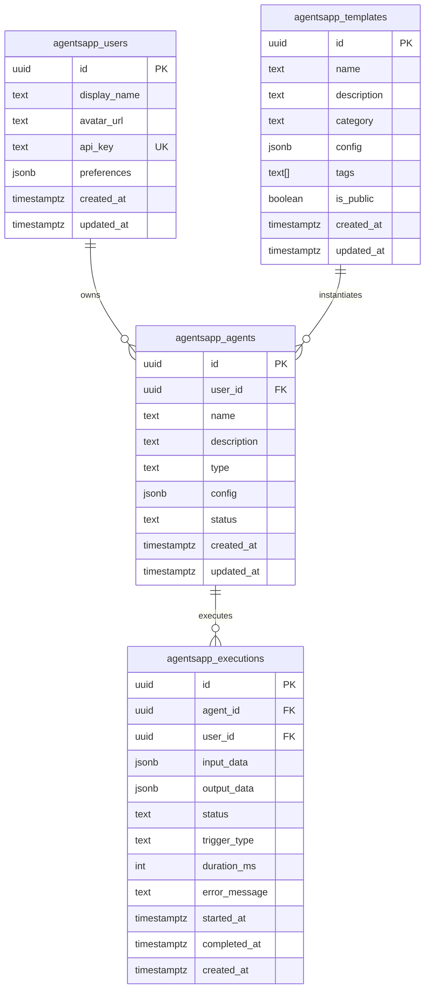

---

## Authentication Flow

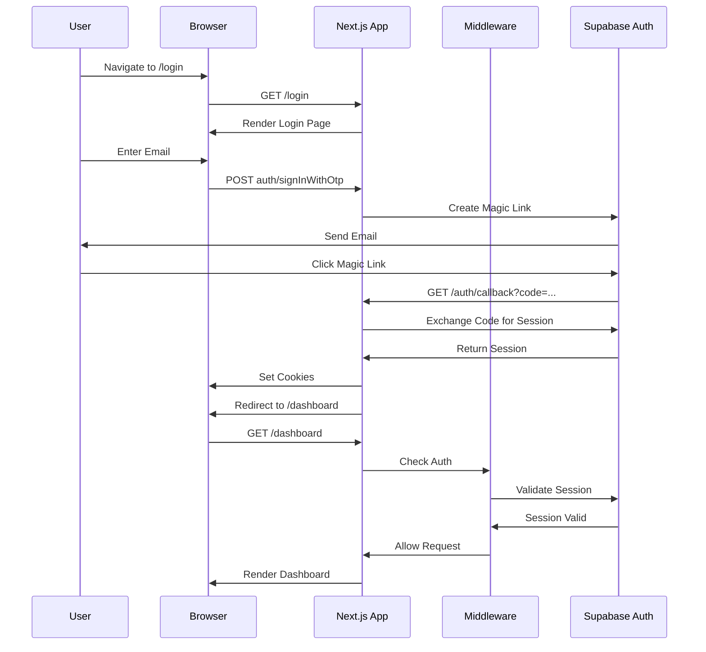

---

## Agent Execution Flow

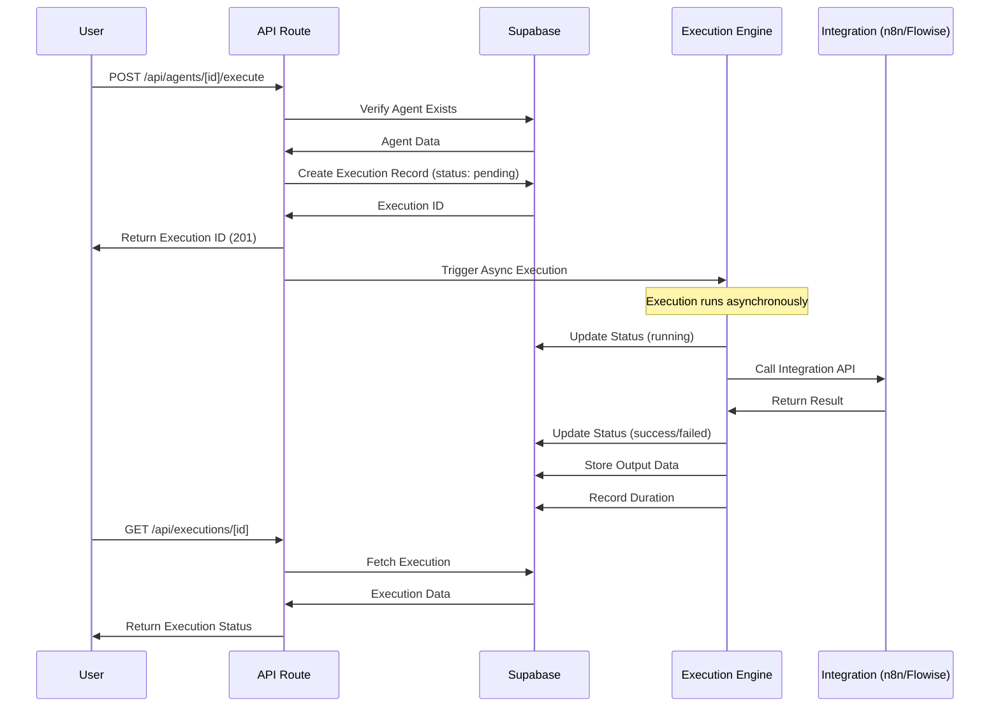

---

## API Request/Response Flow

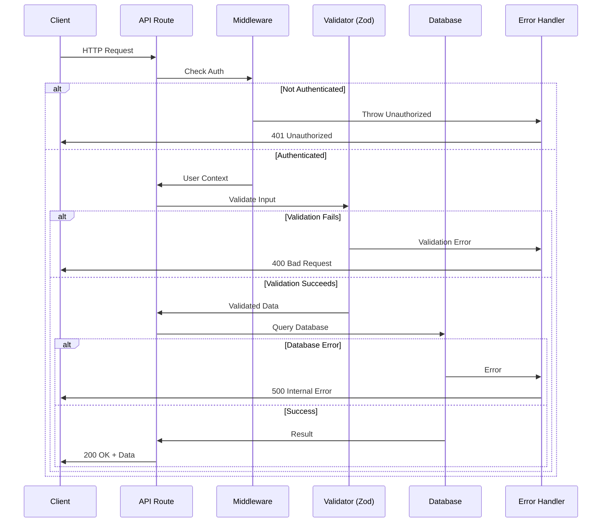

---

## Component Hierarchy

```mermaid
graph TD
    A[RootLayout] --> B[DashboardLayout]
    B --> C[Navbar]
    B --> D[Sidebar]
    B --> E[Main Content]

    E --> F[Dashboard Page]
    E --> G[Agents Pages]
    E --> H[Templates Page]
    E --> I[Executions Pages]
    E --> J[Settings Page]

    G --> K[AgentList]
    G --> L[AgentDetail]
    G --> M[NewAgent]

    L --> N[AgentEditor]
    L --> O[RecentExecutions]

    H --> P[TemplateGrid]
    H --> Q[TemplateFilters]

    I --> R[ExecutionList]
    I --> S[ExecutionDetail]

    J --> T[ProfileSettings]
    J --> U[ApiKeySettings]
    J --> V[IntegrationSettings]

    style A fill:#1f4d2f
    style B fill:#10b981
    style E fill:#3ecf8e
```

---

## Deployment Architecture

```mermaid
graph TB
    subgraph "VPS: srv867044.hstgr.cloud"
        A[Traefik Reverse Proxy]

        subgraph "Services"
            B[AI Agents Studio:3000]
            C[n8n]
            D[Flowise]
            E[Gotenberg]
            F[Supabase]
        end
    end

    A -->|agents.smartcamp.ai| B
    A -->|n8n.smartcamp.ai| C
    A -->|flowise.smartcamp.ai| D
    A -->|gotenberg.smartcamp.ai| E
    A -->|api.supabase.smartcamp.ai| F

    B --> G[(PostgreSQL)]
    F --> G

    H[Internet] -->|HTTPS| A
    A -->|Let's Encrypt| I[SSL Certificates]

    style A fill:#1f4d2f
    style B fill:#10b981
    style G fill:#3ecf8e
```

---

## Integration Flow

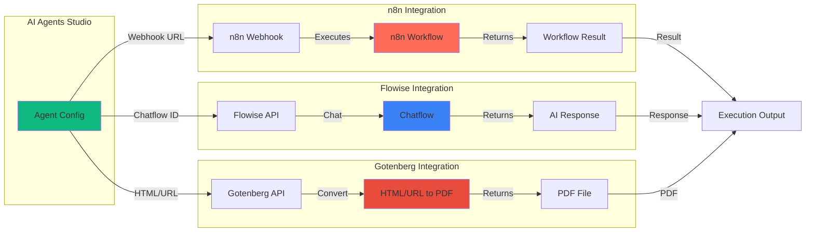

---

## State Management

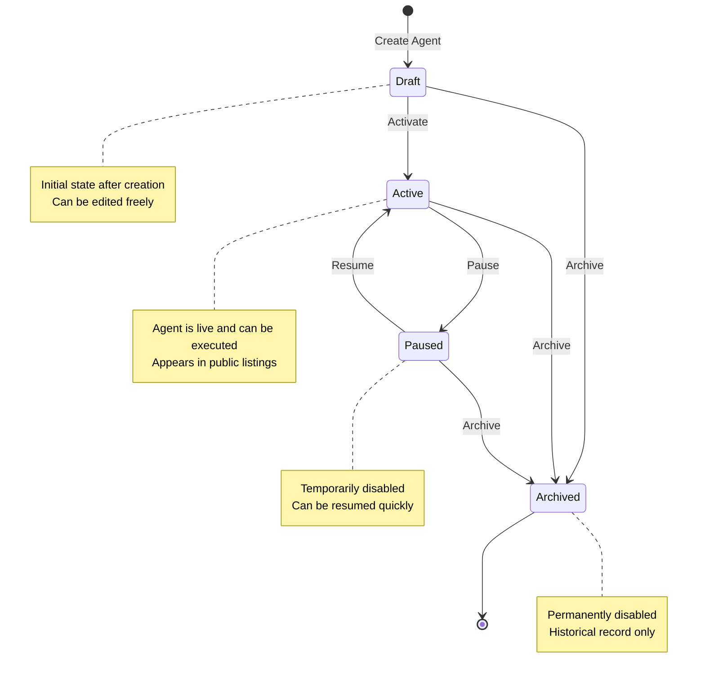

---

## Execution State Machine

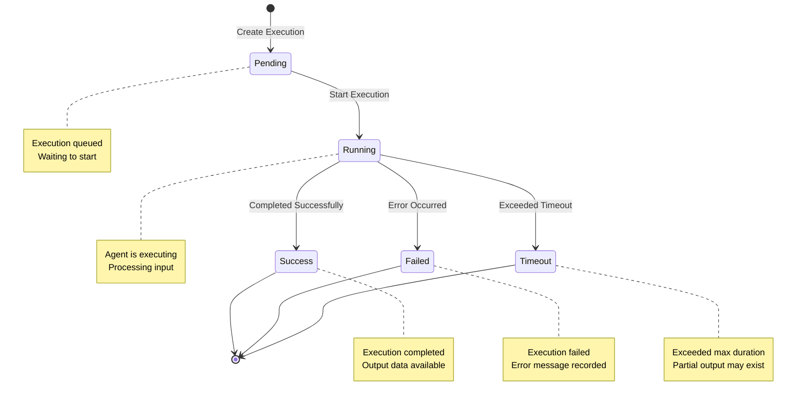

---

## Technology Stack Diagram

```mermaid
graph TB
    subgraph "Frontend"
        A[React 18] --> B[Next.js 14]
        B --> C[TypeScript 5.6]
        C --> D[Tailwind CSS 3.4]
    end

    subgraph "Backend"
        E[Next.js API Routes] --> F[Supabase Client]
        F --> G[PostgreSQL 15]
    end

    subgraph "State & Data"
        H[React Context] --> I[Zustand]
        J[Zod Validation] --> K[React Hook Form]
    end

    subgraph "Testing"
        L[Jest] --> M[React Testing Library]
        N[Supertest] --> O[MSW]
    end

    subgraph "Deployment"
        P[Docker] --> Q[Traefik]
        Q --> R[Let's Encrypt SSL]
    end

    B --> E
    I --> B
    K --> B
    M --> B
    P --> B

    style B fill:#10b981
    style G fill:#3ecf8e
    style Q fill:#1f4d2f
```

---

_These diagrams provide a visual overview of the AI Agents Studio architecture. They are generated using Mermaid and can be viewed in any Markdown renderer that supports Mermaid syntax._
